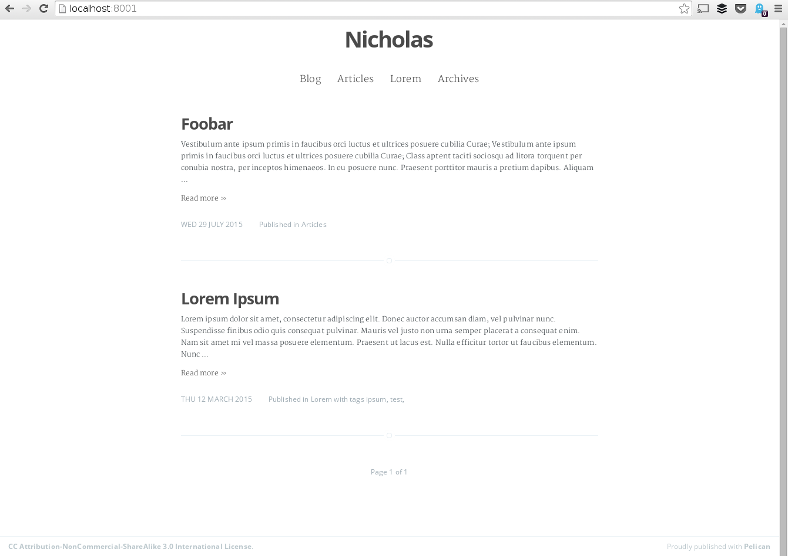
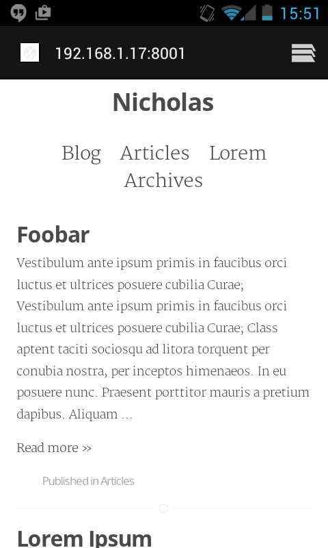

# Nicholas

This Pelican theme is based on [Casper](https://github.com/TryGhost/Casper), the default theme of blogging platform [Ghost](https://github.com/TryGhost/Ghost).
The work is based on the port [Casper2Pelican](https://github.com/abr4xas/Casper2Pelican).

The name of the theme comes from Nicholas de Mimsy-Porpington, also known as Nerly Headless Nick, the resident ghost of Gryffindor Tower.

## Screenshots

## Supported Settings

### Disqus

Disqus can be activated on articles by setting `DISQUS_SITENAME`.

### Google Analytics

Google Analytics is added to every page if `GOOGLE_ANALYTICS` is set.

### Menu customization

The navigation bar honors the following settings:

 * `DISPLAY_CATEGORIES_ON_MENU=True` will show all categories in the navigation bar
 * `DISPLAY_PAGES_ON_MENU=True` will show all pages in navigation bar
 * The link _Archives_ is added if `ARCHIVES_SAVE_AS` is not empty

### Archives and indexes

If `ARCHIVES_SAVE_AS` is not empty (default: `archives.html`), general, category and tag indexes will show a paginated (following the setting `DEFAULT_PAGINATION`) list of article excerpts.

Otherwise, they show an archive-style list of articles without pagination. In this case it is recommended to set `DEFAULT_PAGINATION` to 0 to prevent the generation of redondant files.

## Missing or untested features

 * Author page
 * Authors page (_list of authors_)
 * Tags page (_list of tags_)
 * Categories page (_list of categories_)

## Copyright & License

Copyright (c) 2013-2015 Ghost Foundation - Released under the MIT [License](LICENSE).
